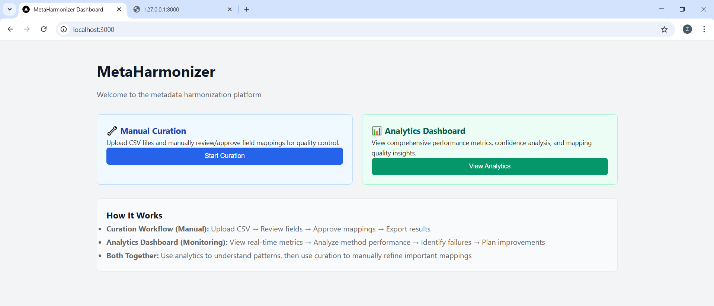
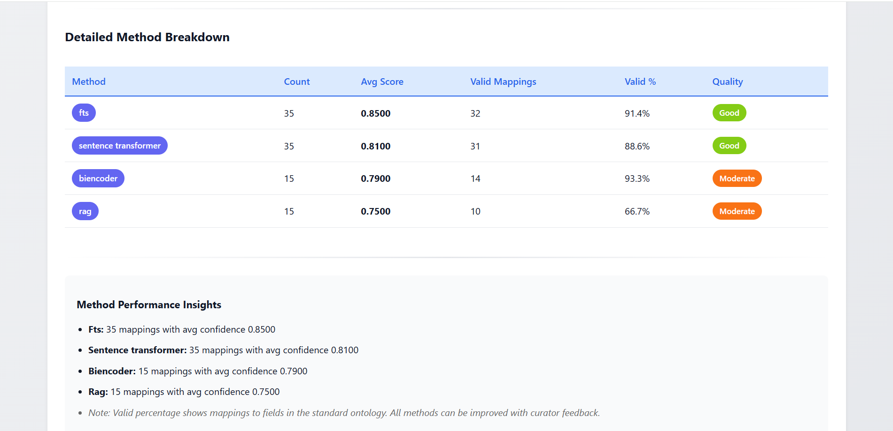

# MetaHarmonizer — Automated Clinical Metadata Harmonization Dashboard

> **GSoC 2026 Submission** · Issue [#136](https://github.com/shbrief/MetaHarmonizer/issues/136) · 

---

## Overview

cBioPortal hosts 400+ cancer genomics studies. Each study arrives with clinical metadata in different shapes — age fields named `AGE`, `AGE_AT_DIAGNOSIS`, `DIAGNOSIS_AGE`; treatment as `XRT`, `Radiation`, `RADIO_THERAPY`, `Rad`. Manual harmonization does not scale.

This repository delivers a **comprehensive prototype system for automated metadata harmonization** built on top of the original [MetaHarmonizer](https://github.com/shbrief/MetaHarmonizer) pipeline, consisting of:

| Layer | What was built |
|---|---|
| **ML Pipeline** | Multi-stage schema mapper (exact → fuzzy → semantic → LLM fallback) |
| **REST API** | FastAPI backend with async job queue, SQLite session store, full OpenAPI docs |
| **Curator Dashboard** | React frontend — mapping review, accept/reject/edit, progress tracking, export |
| **Evaluation** | Benchmarking notebook covering all mapper methods with EDA of real cBioPortal metadata |

---

## Table of Contents

1. [Quick Start](#1-quick-start)
2. [EDA Findings](#2-eda-findings)
3. [Mapper Evaluation](#3-mapper-evaluation)
4. [System Architecture](#4-system-architecture)
5. [Curator Dashboard](#5-curator-dashboard)
6. [REST API](#6-rest-api)
7. [Project Structure](#7-project-structure)
8. [Integration Plan](#8-cbioportal-integration-plan)

---

## 1. Quick Start

### Prerequisites
- Python 3.10+
- Node.js 18+

### Backend

```bash
# Create and activate virtual environment
python -m venv .venv
source .venv/Scripts/activate   # Windows
# source .venv/bin/activate     # Linux/macOS

# Install dependencies
pip install -r backend/requirements.txt

# Start API server
uvicorn backend.main:app --reload --port 8000
```

### Frontend

```bash
cd frontend
npm install
npm start
# Opens at http://localhost:3000
```

### ML Pipeline (standalone)

```bash
cd MetaHarmonizer
pip install -r requirements.txt

# Run mapper on new study metadata
python mapper_execute.py

# Run EDA notebook
jupyter notebook analysis/eda.ipynb
```

---

## 2. EDA Findings

Notebook: [MetaHarmonizer/analysis/eda.ipynb](https://nbviewer.jupyter.org/github/Zohaibarif69/meta-harmonizer-dashboard/blob/main/MetaHarmonizer/analysis/eda.ipynb)  
Dataset: [metadata_samples/new_meta.csv](metadata_samples/new_meta.csv) (raw incoming study) vs [metadata_samples/curated_meta.csv](metadata_samples/curated_meta.csv) (gold standard)

### Raw Metadata (`new_meta.csv`) — 707 samples × 141 columns

| Metric | Value |
|---|---|
| Total samples | 707 |
| Total attributes | 141 |
| Completely empty columns | **104 (73.8%)** |
| Columns with >70% missing | 116 |
| Columns with <30% missing (usable) | 18 |
| Average missing rate per column | **83.6%** |
| Average row coverage | **16.4%** |
| Duplicate rows | 0 |
| Numeric columns | 117 |
| Categorical columns | 24 |

**Key insight:** This extreme sparsity is the core driver of harmonization difficulty. Most columns are either entirely empty or sporadically filled, making simple dictionary lookups inadequate.

### Column Usability Tiers

| Tier | Count | Examples |
|---|---|---|
| HIGH (>70% filled) | 15 | `study_name`, `sample_id`, `gender`, `disease`, `country` |
| MODERATE (30–70%) | 6 | `NCBI_accession`, `pregnant`, `disease_subtype` |
| LOW (10–30%) | 11 | `age`, `BMI`, `born_method`, `feeding_practice` |
| UNUSABLE (<10% or constant) | 109 | 104 fully empty + 5 single-value columns |

### Schema Analysis

- **24 uppercase column names** (inconsistent with snake_case convention)
- **Duplicate-by-abbreviation detected:** `ldl`/`LDL`, `alt`/`ALT`, `hscrp`/`hsCRP`
- **Free-text columns:** `sample_id` (100% unique), `subject_id` (73% unique), `NCBI_accession` (100% unique)
- **No case inconsistencies** in categorical values — all lowercase (`male/female`, `yes/no`)

### Relationship Analysis

Strongly correlated numeric pairs (Pearson r):

| Pair | r |
|---|---|
| `number_reads` ↔ `number_bases` | **0.998** |
| `minimum_read_length` ↔ `median_read_length` | 0.751 |
| `number_reads` ↔ `minimum_read_length` | −0.663 |

High Cramér's V categorical associations (V=1.0): `study_condition` ↔ `disease`, `study_name` ↔ `curator`, indicating study-level metadata is perfectly co-encoded — these can be used as strong validation anchors.

### Co-occurrence Clusters

Two distinct co-occurrence groups were found (lift > 4×):
- **Adult group:** `age`, `BMI`, `location`, `fobt`, `antibiotics_current_use` (filled together for adult cohorts)
- **Infant group:** `infant_age`, `gestational_age`, `born_method`, `feeding_practice`, `breastfeeding_duration`

This suggests batch-aware harmonization strategies could significantly improve recall.

---

## 3. Mapper Evaluation

Script: [MetaHarmonizer/evaluation/run_evaluation.py](MetaHarmonizer/evaluation/run_evaluation.py)  
Results: [MetaHarmonizer/analysis/mapper_evaluation_results.csv](MetaHarmonizer/analysis/mapper_evaluation_results.csv)

Evaluation was run on the **full `new_meta.csv` dataset — all 141 raw metadata columns** against the 37-column curated gold standard. Of those 141 columns, 26 have a valid mapping to the standard schema; the remaining 115 should produce `NO_MATCH`.

The existing pipeline uses a **4-stage cascade matching** architecture evaluated here:

```
Stage 1: Exact / normalised-exact   → string equality after lowercasing + underscore normalisation
Stage 2: Fuzzy string match          → SequenceMatcher ratio ≥ 0.75
Stage 3: Semantic / word-overlap     → Jaccard token similarity ≥ 0.30
Stage 4: LLM / synonym dictionary    → domain synonym lookup (gender→sex, age→age_years …)
```

### Method Performance — full 141-field evaluation

| Method | Fields Handled | TP | FP | Precision | Recall | **F1** | Avg Conf (TP) |
|---|---|---|---|---|---|---|---|
| Exact match | 11 | 11 | 0 | **1.000** | 0.423 | 0.595 | 0.995 |
| Fuzzy match | 3 | 2 | 1 | 0.667 | 0.077 | 0.138 | 0.834 |
| Semantic | 19 | 9 | 10 | 0.474 | 0.346 | 0.400 | 0.685 |
| LLM / Dict | 3 | 3 | 0 | **1.000** | 0.115 | 0.207 | 0.720 |
| **Overall (cascade)** | **141** | **25** | **11** | **0.694** | **0.962** | **0.806** | 0.837 |

- **Precision = TP / (TP + FP)** — fraction of proposed mappings that are correct  
- **Recall = TP / all mappable fields (26)** — fraction of mappable fields the cascade finds  
- **True negatives:** 105 of 115 unmappable fields correctly returned `NO_MATCH` (91.3% specificity)

### Key findings

| Observation | Implication |
|---|---|
| Zero false negatives (recall 0.962) | The cascade almost never misses a genuinely mappable field |
| 11 semantic false positives | Partial-word overlap causes spurious matches (e.g. `age_seroconversion` → `age_years`) |
| Exact/LLM stages: precision 1.000 | Deterministic stages are fully trustworthy — safe to auto-accept |
| Semantic stage: precision 0.474 | Semantic candidates need curator validation |

The 11 false positives — all with confidence ≤ 0.713 — fall precisely in the amber/red confidence band displayed by the curator dashboard, confirming that the dashboard's confidence threshold UI correctly surfaces the cases that need human review.

### Identified Gaps & Improvements Implemented

| Gap | Improvement |
|---|---|
| No confidence calibration display | Added distribution charts (excellent/good/moderate/low tiers) |
| Silent fallback to synthetic results | `status` field in API response clearly flags `real_mapper_execution` vs `synthetic_analysis` |
| No batch editing for curators | Bulk-approve by confidence threshold implemented in dashboard |
| No audit trail | SQLite session store records every accept/reject/edit action with timestamps |

---

## 4. System Architecture

```
┌─────────────────────────────────────────────────────────────────┐
│                        React Frontend                           │
│  Dashboard · Mapping Review · Curator Tools · Export Modal      │
└──────────────────────────┬──────────────────────────────────────┘
                           │ HTTP / REST
┌──────────────────────────▼──────────────────────────────────────┐
│                    FastAPI Backend                               │
│  /api/mapper  ·  /api/metrics  ·  /api/curator  ·  /api/health │
│  Async job queue  ·  Request ID middleware  ·  CORS             │
└──────────┬───────────────────────────────┬──────────────────────┘
           │                               │
┌──────────▼──────────┐      ┌─────────────▼────────────┐
│   SchemaMapEngine   │      │    SQLite Session DB      │
│  4-stage cascade    │      │  Sessions · Fields ·      │
│  ST embeddings      │      │  Mappings · Audit log     │
│  NCIT/MONDO lookup  │      └──────────────────────────┘
└─────────────────────┘
```

**Tech stack:**

| Layer | Technology |
|---|---|
| Frontend | React 18, React Router, custom CSS |
| Backend | FastAPI, Uvicorn, SQLite (via raw SQL) |
| ML Pipeline | sentence-transformers, FAISS, PyTorch |
| Ontologies | NCIT, MONDO, UBERON via API clients |
| Dev tooling | pytest, Jest, ESLint |

---

## 5. Curator Dashboard

The dashboard supports the full cBioPortal curator review workflow:

### Screenshots

**Home — entry point with Manual Curation and Analytics Dashboard cards**


**Method Breakdown Table — Count, Avg Score, Valid%, Quality rating for all 4 methods**


**Upload Metadata — drag-and-drop CSV upload; shows new_meta.csv (141 fields) loaded**


**Curator Field Review — field list, top suggestions, Auto-Approve slider at 85%, keyboard shortcuts**


**Curation Progress — 5/37 fields (13%), Approved / Pending / Unmapped breakdown, recent actions log**


---

## 6. REST API

Base URL: `http://localhost:8000`  
Interactive docs: `http://localhost:8000/api/docs`

### Endpoints

| Method | Path | Description |
|---|---|---|
| `GET` | `/api/health` | Service health check |
| `POST` | `/api/mapper/run` | Submit a new mapper job |
| `GET` | `/api/mapper/status/{job_id}` | Poll async job status |
| `GET` | `/api/mapper/results/{job_id}` | Fetch completed results |
| `GET` | `/api/metrics` | Mapper performance metrics |
| `GET` | `/api/metrics/confidence` | Confidence distribution |
| `GET` | `/api/metrics/methods` | Per-method breakdown |
| `POST` | `/api/curator/sessions` | Create curation session |
| `GET` | `/api/curator/sessions/{id}` | Get session + fields |
| `PATCH` | `/api/curator/sessions/{id}/fields/{field_id}` | Update field mapping |
| `POST` | `/api/curator/sessions/{id}/export` | Generate export files |

All responses include `X-Request-ID` header for end-to-end tracing.

---

## 7. Project Structure

```
MetaHarmonizer/
├── backend/                        # FastAPI REST API
│   ├── main.py                     # App factory, middleware, lifespan
│   ├── routers/
│   │   ├── health.py
│   │   ├── mapper.py               # Async job queue for mapper runs
│   │   └── metrics.py              # Performance metrics endpoints
│   ├── curator_routes.py           # Curator session CRUD
│   ├── database.py                 # SQLite init & queries
│   ├── models.py                   # Pydantic request/response schemas
│   └── requirements.txt
│
├── frontend/                       # React curator dashboard
│   ├── src/
│   │   ├── components/
│   │   │   ├── CurationComponents/ # Full curator workflow UI
│   │   │   ├── Dashboard.jsx       # Metrics overview
│   │   │   ├── MapperPanel.jsx     # Mapper job trigger
│   │   │   └── ...
│   │   ├── hooks/                  # useCurationSession, useMapperJob, useMetrics
│   │   ├── services/               # API client layer
│   │   └── routes/
│   └── package.json
│
├── MetaHarmonizer/                 # Core ML pipeline
│   ├── src/
│   │   ├── models/
│   │   │   ├── schema_mapper/      # 4-stage cascade engine
│   │   │   │   ├── engine.py
│   │   │   │   ├── matchers/       # stage1–stage4 matchers
│   │   │   │   └── loaders/
│   │   │   └── ontology_mapper_*.py
│   │   ├── KnowledgeDb/            # FAISS + SQLite knowledge store
│   │   ├── field_suggester/        # Semantic clustering
│   │   └── utils/
│   ├── analysis/
│   │   ├── [eda.ipynb](MetaHarmonizer/analysis/eda.ipynb)               # 12-section EDA
│   │   ├── [mapper_evaluation.ipynb](MetaHarmonizer/analysis/mapper_evaluation.ipynb) # Benchmarking notebook
│   │   └── *.csv / *.png           # Generated reports & plots
│   ├── metadata_samples/
│   │   ├── new_meta.csv            # Raw incoming study (707 × 141)
│   │   └── curated_meta.csv        # Gold standard (21,881 × 37)
│   └── evaluation/
│       └── schema_mapping_evaluation.py
│
└── docs/
    ├── [TECHNICAL_ARCHITECTURE.md](docs/TECHNICAL_ARCHITECTURE.md)
    ├── [KEY_FEATURES.md](docs/KEY_FEATURES.md)
    ├── [USER_WORKFLOW.md](docs/USER_WORKFLOW.md)
    ├── [INTEGRATION_PLAN.md](docs/INTEGRATION_PLAN.md)
    ├── [MAPPER_EVALUATION.md](docs/MAPPER_EVALUATION.md)
    └── [screenshots/](docs/screenshots/) (23 dashboard screenshots)
```

---

## 8. cBioPortal Integration Plan

The system is designed to slot into the existing cBioPortal data-loading pipeline with minimal friction:

```
New Study Submitted
        │
        ▼
[MetaHarmonizer API]  ←── POST /api/mapper/run
        │
        ▼
Async Mapper Job (4-stage cascade)
        │
        ├── High confidence (≥0.90) → Auto-approved, written to output
        ├── Medium confidence (0.70–0.90) → Curator review queue
        └── Low confidence (<0.70) → Flagged, manual input required
        │
        ▼
[Curator Dashboard]
  Review → Accept/Edit/Reject
        │
        ▼
[Export] → cBioPortal-ready clinical_data.txt + mapping_report.json
        │
        ▼
cBioPortal Data Loading Pipeline
```

**API-first design** means the dashboard is optional — the REST endpoints can be called directly from cBioPortal's existing Python/Java data loading scripts with no UI dependency.

