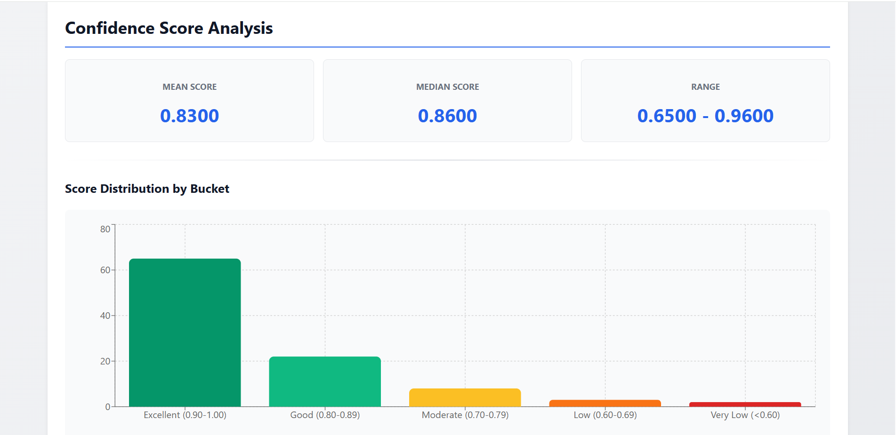
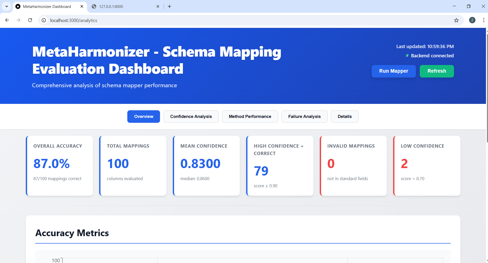

# Key Features

**Project:** MetaHarmonizer — Automated Clinical Metadata Harmonization Dashboard  
**GSoC 2026 · Issue #136 · cBioPortal**

---

## 1. Automated Schema Mapping

The system automatically suggests standard field names for every raw metadata column, eliminating the need for curators to start from scratch on each dataset.

- Maps raw column names to the curated cBioPortal schema using a four-stage pipeline
- Returns top-5 ranked suggestions per field, each with a confidence score and matching method
- Handles synonyms, typos, abbreviations, and domain-specific terminology
- Fields the system cannot resolve are flagged for manual curator entry — nothing is silently dropped

---

## 2. Curator Mapping Review Interface

The dashboard gives domain experts full control to review, correct, and approve every automatically generated mapping before the data is exported.

- **Top-5 suggestions** per field ranked by confidence, with method label visible
- **Sample values panel** — real data values shown alongside each suggestion for contextual validation
- **Three actions per field:** Approve · Mark Unmapped · Enter custom value
- **Keyboard shortcuts** — `↓/N` next, `↑/P` previous, `Enter` approve — for high-speed review
- **Curation notes** — optional free-text reasoning saved per field for audit purposes

---

## 3. Confidence-Aware Mapping Display

Mappings are colour-coded by confidence so curators can immediately focus their attention on uncertain predictions instead of reviewing every field manually.

| Tier | Score | Colour | Meaning |
|---|---|---|---|
| Excellent | ≥ 0.90 | Green | Safe to auto-approve |
| Good | 0.80–0.89 | Green | Quick review recommended |
| Moderate | 0.70–0.79 | Amber | Curator decision required |
| Low | < 0.70 | Red | Manual mapping recommended |

---

## 4. Ontology-Assisted Metadata Mapping

When a curator enters a custom field name, they can look up valid ontology terms directly inside the interface — no need to leave the tool.

- Integrated search across **NCIT**, **UMLS**, and **SNOMED**
- Ontology term codes saved alongside the human-readable field name
- Ensures custom mappings remain standards-compliant, not free-form text

---

## 5. Bulk Auto-Approve

Curators can approve all high-confidence mappings in one click, reserving their time for the fields that genuinely need review.

- Configurable confidence threshold slider (default 85%)
- Auto-approves all fields at or above the threshold in a single action
- Session progress updates immediately — Approved / Pending / Unmapped counts refresh live

---

## 6. Mapping Analytics Dashboard

A purpose-built analytics view lets curators and project leads monitor mapper performance across the full dataset before and during curation.

- **Overview tab** — overall accuracy, total mappings, mean and median confidence
- **Method Performance tab** — per-method breakdown (count, avg score, valid %) with interactive charts
- **Failure Analysis tab** — failure categories, low-confidence counts, and suggested remediation actions
- **Confidence Distribution** — histogram showing spread across all confidence tiers

---

## 7. Multi-Format Harmonized Export

Once curation is complete, the session produces publication-ready output files in one click.

- **CSV** — harmonized metadata with cBioPortal-standard column names, ready to load
- **JSON** — full mapping report including field name, standard name, confidence, method, and curator decision
- **Parquet** — big-data compatible format for downstream analysis pipelines
- All exports optionally include the full **curation audit trail** — every approve, reject, and edit, with timestamps

---

