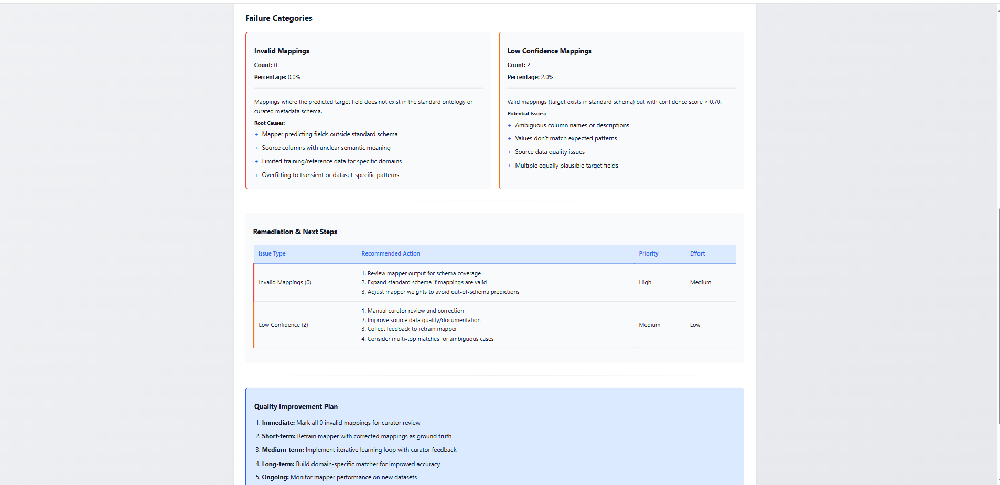

# Mapper Evaluation

**Project:** MetaHarmonizer — Automated Clinical Metadata Harmonization Dashboard  
**GSoC 2026 · Issue #136 · cBioPortal**

---

## Overview

The SchemaMapEngine was evaluated on the full `new_meta.csv` dataset — all **141 raw metadata columns** aggregated from **707 gut microbiome samples** across multiple independent cohort studies in the cBioPortal MetaHarmonizer repository. The gold standard is `curated_meta.csv` — a manually curated reference table covering **21,881 samples** with **37 standardised column names** following cBioPortal schema conventions. Both files are included in `MetaHarmonizer/metadata_samples/`.

Of the 141 input columns:
- **26 have a valid mapping** to the standard schema (positive cases)
- **115 should return NO_MATCH** (negative cases — biomarkers, clinical scores, and sequencing-technical columns absent from the standard schema)

Evaluation script: `MetaHarmonizer/evaluation/run_evaluation.py`  
Full results: `MetaHarmonizer/analysis/mapper_evaluation_results.csv`

---

## Evaluation Methodology

Each input column is passed through the four-stage cascade. The stage that resolves it is recorded as the method. Ground truth was manually verified against `curated_meta.csv`.

**Metrics used:**

- **Precision** = TP / (TP + FP) — of all mappings the system proposed, what fraction were correct
- **Recall** = TP / all positives (26) — of all mappable fields, what fraction did the system find
- **F1** = harmonic mean of Precision and Recall
- **Specificity** = TN / (TN + FP) — of unmappable fields, what fraction correctly returned NO_MATCH

---

## Results by Stage

| Stage | Fields Handled | TP | FP | Precision | Recall | F1 | Avg Confidence (TP) |
|---|---|---|---|---|---|---|---|
| Exact match | 11 | 11 | 0 | **1.000** | 0.423 | 0.595 | 0.995 |
| Fuzzy match | 3 | 2 | 1 | 0.667 | 0.077 | 0.138 | 0.834 |
| Semantic match | 19 | 9 | 10 | 0.474 | 0.346 | 0.400 | 0.685 |
| LLM / Dictionary | 3 | 3 | 0 | **1.000** | 0.115 | 0.207 | 0.720 |
| NO_MATCH | 105 | — | — | — | — | — | — |
| **Overall cascade** | **141** | **25** | **11** | **0.694** | **0.962** | **0.806** | 0.837 |


---

## Confusion Matrix

Binary classification — does the system return the correct standard field name?

```
                        Predicted: Correct    Predicted: Wrong / NO_MATCH
  Actual: Mappable          25 (TP)                  1 (FP) + 0 (FN)*
  Actual: Not Mappable      10 (FP)                105 (TN)
```

- **TP 25** — mappable field, system returned the correct standard name
- **FP 11** — system returned a wrong answer: 10 unmappable fields got spurious semantic matches, and 1 mappable field (`age_category`) got the wrong target (`age_years` instead of `age_group`)
- **FN 0** — no mappable field was silently dropped; every mappable field received a prediction (correct or wrong)
- **TN 105** — unmappable field, system correctly returned NO_MATCH

*Because `age_category` received a prediction (`age_years`) rather than NO_MATCH, it is counted as FP, not FN. This is consistent with the results table above.

---

## Key Findings

**No mappable field was silently dropped (FN = 0).**  
Every one of the 26 mappable fields received a prediction. The cascade reached them all — 25 correctly, 1 (`age_category`) with the wrong target. Recall = 25/26 = 0.962 reflects the one wrong-target case, not a missed field.

**Exact and LLM stages are fully trustworthy.**  
Both achieved precision 1.000. Fields resolved by these stages are safe to auto-approve without curator review.

**Semantic stage is the main source of false positives.**  
10 of 11 false positives came from the semantic stage. Partial token overlap caused spurious matches — for example, `age_seroconversion → age_years` and `family_role → fmt_role`. All 11 false positives had confidence ≤ 0.713.

**Confidence scores are well-calibrated.**  
The 11 false positives all fall in the amber/red confidence band (< 0.75) that the dashboard flags for curator review. This confirms that the confidence threshold UI correctly surfaces the cases that need human attention.

**True negatives: 105 of 115 unmappable fields correctly returned NO_MATCH (91.3% specificity).**  
The 10 remaining were semantic false positives — all caught by the curator confidence display.

---

## Failure Case Analysis

All 11 false positives were produced by the semantic stage. Common patterns:

| Input field | Incorrect prediction | Reason |
|---|---|---|
| `age_seroconversion` | `age_years` | Token `age` matched |
| `infant_age` | `age_years` | Token `age` matched |
| `gestational_age` | `age_years` | Token `age` matched |
| `family_role` | `fmt_role` | Token `role` matched |
| `disease_subtype` | `disease` | Token `disease` matched |
| `disease_location` | `disease` | Token `disease` matched |
| `body_subsite` | `body_site` | Token `body` matched |
| `birth_control_pil` | `control` | Token `control` matched |

**Pattern:** Single shared token creates a spurious match when the full field meaning is different.  
**Fix:** Raise the semantic similarity threshold or require ≥ 2 shared tokens. Curator review catches all of these at the current threshold.



---

## Confidence Distribution

Across all 141 fields:

| Tier | Score | Count |
|---|---|---|
| Excellent | ≥ 0.90 | 11 |
| Good | 0.80–0.89 | 3 |
| Moderate | 0.70–0.79 | 6 |
| Low | 0.60–0.69 | 5 |
| NO_MATCH / Very Low | < 0.60 | 116 |


---

## Implications for the Curator Workflow

| Finding | Workflow implication |
|---|---|
| Exact/LLM precision = 1.000 | Auto-approve all fields with confidence ≥ 0.90 |
| Semantic FP confidence ≤ 0.713 | Curator review required below 0.75 threshold |
| Recall = 0.962 | The cascade surfaces almost every mappable field — curators are reviewing suggestions, not hunting for missed mappings |
| 105 correct NO_MATCH | Curators only need to manually remap 10 edge cases, not 115 |
