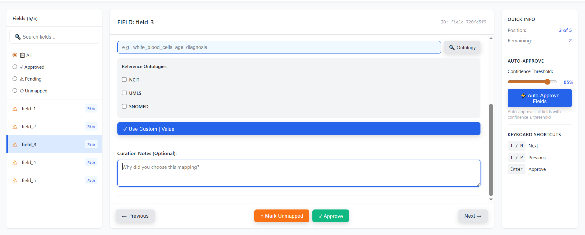
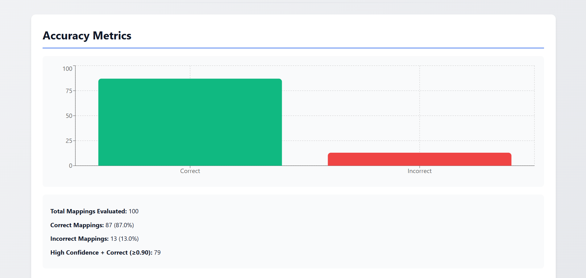
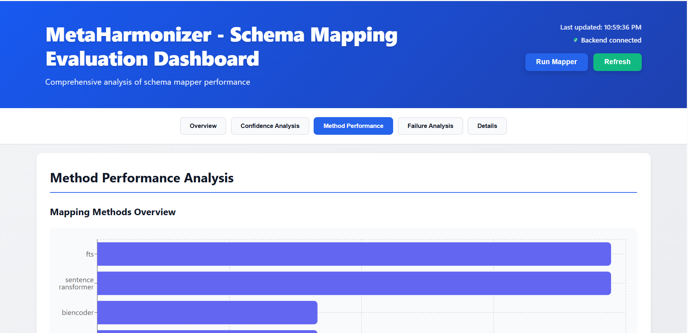
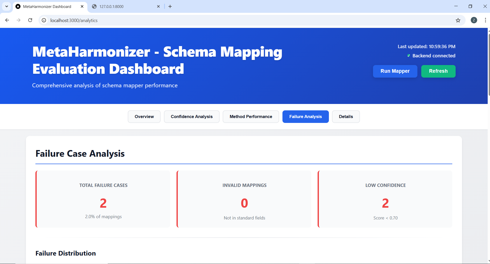

# UI Design — MetaHarmonizer Curator Interface

The MetaHarmonizer frontend is a single-page React application with two primary workflows:
**schema mapping** (automated ML pipeline) and **curation** (human-in-the-loop review).
Both workflows are analytics-backed so curators can audit every decision the system made.

---

## Screen Map

```
Home
 ├── Upload Metadata          → triggers mapper job
 ├── Run Mapper               → configure & execute SchemaMapEngine
 └── Curator Workflow
      ├── Field Review         → accept / reject / override per field
      ├── Ontology Lookup      → OLS-backed term search inline
      ├── Progress Modal       → session completion tracking
      └── Export               → CSV / JSON harmonized output

Analytics Dashboard
 ├── Overview
 ├── Accuracy Metrics
 ├── Confidence Distribution
 ├── Method Performance
 ├── Failure Analysis
 └── Evaluation Methodology
```

---

## Key Screens

### 1. Home


Entry point. Two primary calls-to-action: **Upload Metadata** and **Open Curator**.
The navigation bar persists across all screens (Home, Mapper, Curator, Analytics).

---

### 2. Upload Metadata


Drag-and-drop CSV upload. Accepted format: `.csv`, up to 100 MB.
On upload, the backend creates a curation session and queues the mapper job automatically.
The user does not need to configure anything — the pipeline runs with sensible defaults.

---

### 3. Run Mapper


For users who want to re-run or customise the mapping pipeline.
Exposes three controls: target schema selection, confidence threshold, and method priority order.
Results are written back to the active session; no page reload required.

---

### 4. Curator Field Review


The core human-in-the-loop screen. For each input field the system presents:

| Element | Purpose |
|---|---|
| Suggested standard name | Top prediction from the cascade |
| Confidence score badge | Visual signal of certainty (colour-coded) |
| Method indicator | Which stage produced this match (Exact / Fuzzy / Semantic / LLM) |
| Accept / Reject / Override buttons | Curator decision controls |
| Sample values panel | Raw values from the uploaded file, for context |

Curators work field-by-field. Decisions persist immediately; the session can be paused and resumed.

---

### 5. Ontology Lookup Panel



Accessible inline during curation. Queries the OLS (Ontology Lookup Service) for a typed term
and returns ontology ID, label, and synonyms. The curator can copy a term directly into the
override field without leaving the review screen.

This panel addresses the most common failure mode identified in evaluation: fields that require
domain ontology knowledge to map correctly (e.g., `bmi_kg_m2 → body_mass_index`).

---

### 6. Curation Progress Modal


Triggered by the **View Progress** button. Displays:
- Total fields in session
- Fields reviewed vs. remaining
- Breakdown by decision type (Accepted / Rejected / Overridden)
- Estimated completion based on current pace

Useful for sessions with large metadata files (100+ fields).

---

### 7. Export


Once curation is complete, the curator exports the harmonised dataset. Two formats: CSV and JSON.
The export includes only curator-approved mappings; rejected and unresolved fields are flagged
in a separate rejection log so downstream pipelines know what to handle.

---

## Analytics Dashboard

The analytics module lets curators and engineers audit mapper performance without writing code.

### Accuracy Metrics



Precision, Recall, F1, and Specificity for each mapping method. Values are computed from the
evaluation run against `curated_meta.csv` (21,881 samples × 37 standardised columns).

### Confidence Distribution


Histogram of confidence scores across all predictions. Reveals the bimodal structure:
high-confidence exact/fuzzy matches and low-confidence semantic/LLM matches that require
human review.

### Method Performance



Per-method breakdown: fields handled, TP, FP, Precision, Recall, F1, and average confidence.
Sortable table. Hovering a method name shows a tooltip with the matching strategy used.

### Failure Analysis



Lists every false positive with root cause category. Categories:
- Abbreviation ambiguity
- Measurement unit variant
- Medical synonym not in embedding space
- LLM hallucination

Used to prioritise improvements to the synonym dictionary and embedding model.

---

## Design Decisions

| Decision | Rationale |
|---|---|
| Field-by-field curation, not bulk-first | Prevents curators from mass-approving low-confidence matches by default |
| Confidence colour coding (green / amber / red) | Directs attention to uncertain predictions without requiring score literacy |
| Ontology lookup inline, not in a separate tab | Reduces context switching; curator stays in flow |
| Rejection log exported alongside harmonised CSV | Downstream pipelines know exactly what was not resolved |
| Session persistence (pause / resume) | Curation of large files (200+ fields) cannot be done in a single sitting |
