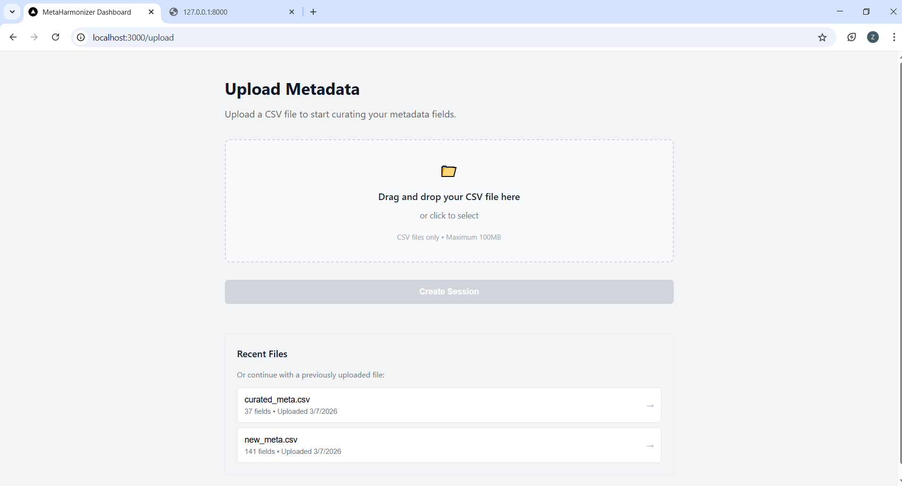
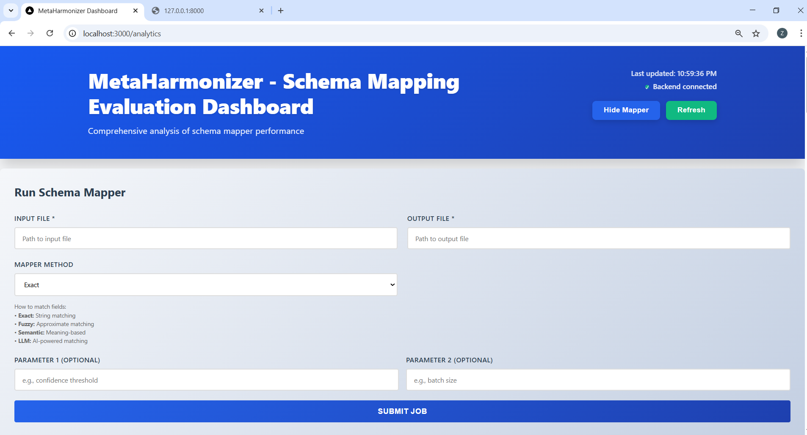
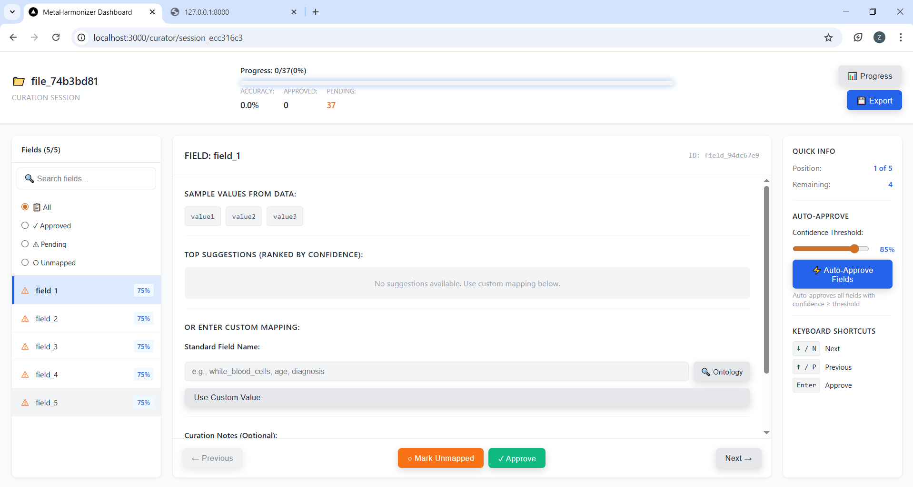
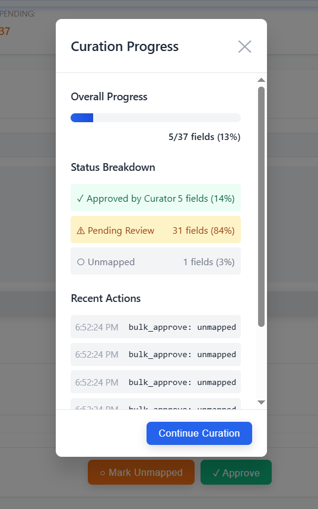
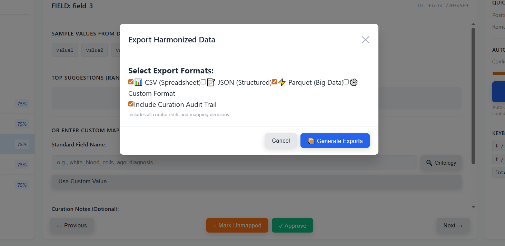

# User Workflow

**Project:** MetaHarmonizer — Automated Clinical Metadata Harmonization Dashboard  
**GSoC 2026 · Issue #136 · cBioPortal**

---

## Overview

A curator starts with a raw clinical metadata file containing non-standard column names and ends with a harmonized, cBioPortal-ready CSV — validated and approved by a domain expert at every step. The workflow has five stages.

---

## Step 1 — Upload Metadata

The curator navigates to the Upload page and submits a CSV file containing the raw study metadata.

- Drag-and-drop or click-to-select (up to 100 MB)
- Previously uploaded files are listed for quick reuse
- System extracts all column names and infers data types on upload



---

## Step 2 — Automatic Mapping

After upload the system runs the schema mapper automatically. No configuration required.

- The four-stage cascade (exact → fuzzy → semantic → LLM) processes every column
- Each column receives up to 5 ranked mapping suggestions with confidence scores
- The job runs asynchronously; the UI shows live progress and completes in seconds to minutes depending on dataset size
- When complete the curator is taken directly to the review interface

**Example — raw column `gender` receives these suggestions:**

| Rank | Suggestion | Confidence | Method |
|---|---|---|---|
| 1 | `sex` | 0.94 | Semantic |
| 2 | `sex_ontology_term_id` | 0.71 | Semantic |
| 3 | `smoker` | 0.42 | Fuzzy |

The curator sees all three and picks the correct one — or enters a custom value.



---

## Step 3 — Review & Curate Mappings

This is the core of the workflow and the human-in-the-loop stage. Automated mapping is intentionally imperfect — the system surfaces its best guesses and a domain expert makes the final call on every field. No mapping reaches the export without curator approval.

**Left panel — field list**
- All columns listed with their current status (Approved / Pending / Unmapped)
- Filter by status to jump straight to uncertain fields

**Centre panel — mapping editor**
- Raw field name and sample data values shown at the top
- Top-5 suggestions ranked by confidence, each labelled with the matching method
- Three actions: **Approve** · **Mark Unmapped** · **Enter custom value**
- Ontology lookup (NCIT, UMLS, SNOMED) available when entering a custom value
- Optional curation notes field for recording reasoning

**Right panel — quick actions**
- Confidence threshold slider — set the auto-approve cutoff (default 85%)
- **Auto-Approve Fields** button — bulk-approves all fields at or above the threshold in one click
- Keyboard shortcuts for rapid navigation: `↓/N` next · `↑/P` previous · `Enter` approve



---

## Step 4 — Monitor Progress

At any point the curator can open the Progress panel to see an up-to-date summary of the session.

- Overall progress bar — fields reviewed out of total
- Status breakdown — Approved / Pending Review / Unmapped counts with percentages
- Recent Actions log — timestamped list of every approve, reject, and edit in the session



---

## Step 5 — Export Harmonized Data

When curation is complete the curator clicks Export and selects output formats.

- **CSV** — harmonized metadata with cBioPortal-standard column names, ready to load directly
- **JSON** — full mapping report: raw field, standard field, confidence, method, curator decision
- **Parquet** — for downstream big-data pipelines
- Optional: include the full **curation audit trail** in the export (every action, who, when)

Files are generated and available for download immediately.



---

## Complete Flow at a Glance

```
Upload CSV
    │
    ▼
Auto-mapping runs (cascade: exact → fuzzy → semantic → LLM)
    │
    ▼
Review Interface
    ├── High confidence fields  →  Auto-Approve in bulk
    └── Low confidence fields   →  Curator reviews one by one
            ├── Accept suggestion
            ├── Choose alternative suggestion
            └── Enter custom value + ontology term
    │
    ▼
Progress: all fields Approved or Unmapped
    │
    ▼
Export  →  CSV · JSON · Parquet  (+audit trail)
    │
    ▼
cBioPortal-ready harmonized metadata
```
